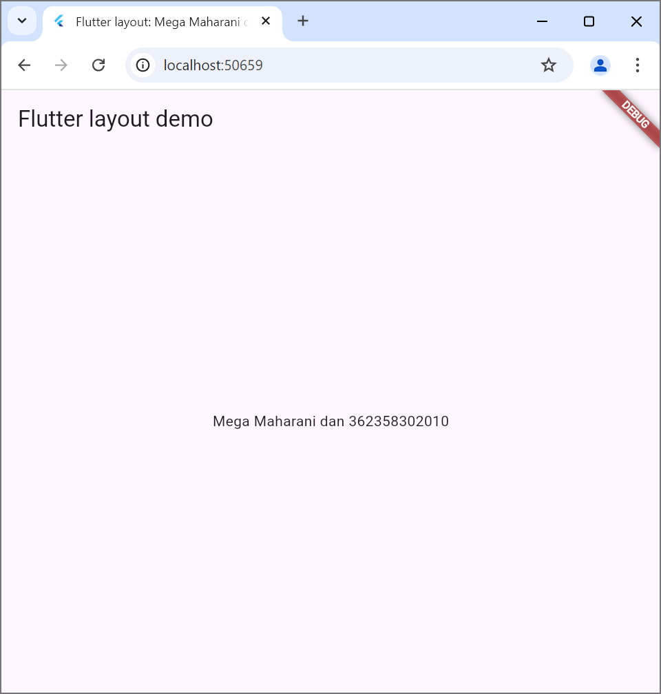
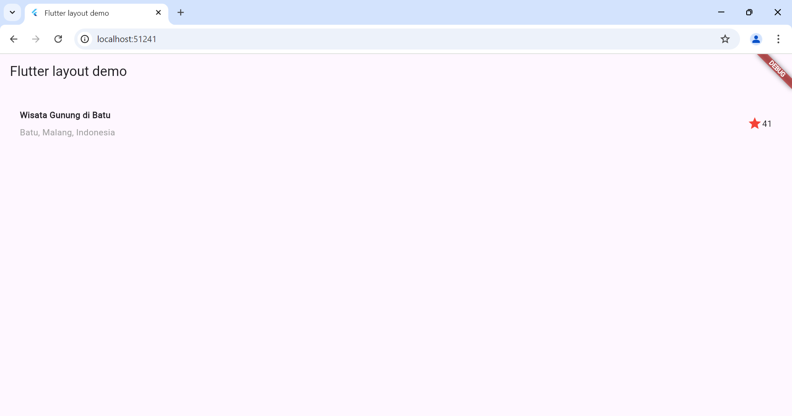

# flutter_application_1

A new Flutter project.

Praktikum 1: Membangun Layout di flutter

Langkah 1: buatlah project flutter baru dengan nama layout_flutter

Langkah 2: buka main.dart lalu ganti kode lalu isi nama dan nim pada text title.

Langkah 3: identifikasi layout diagram
1, identifikasi elemen yang lebih besar
2, buat diagram setiap baris
3, setelah tata letak dibuat lalu pendekatan bottom-up

Langkah 4: implementasi title row 
Widget ini akan menampilkan judul lokasi wisata dan deskripsi serta ikon bintang.

Praktikum 2: Implementasi button row 
Langkah 1: buat method column_buildButtonColumn

