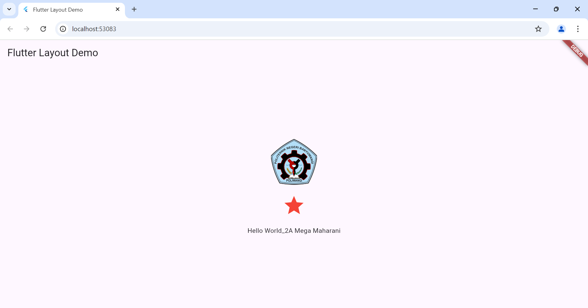

# flutter_application_1

A new Flutter project.

1.Buat folder dengan nama layout_widgets, kemudian buat file text_widget.dart
2.Setelah itu buat file icon_widget.dart di dalam folder layout_widget.
3.Buat file image_widget.dart dalam folder layout_widget.

Hasil:

